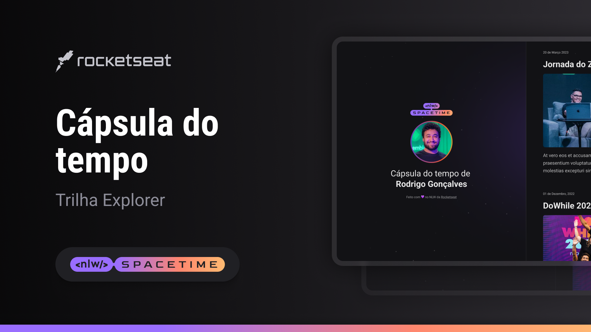

  

## 💻 Projeto
Esse é um projeto Web Responsivo de uma cápsula do tempo para exbir memórias em uma timeline.

## 🚀 Tecnologias
Esse projeto foi desenvolvido durante o NLW da Rocketseat com as seguintes tecnologia:

- HTML
- CSS
- Git e Github

## 🏷️ Layout
Você pode visualizar o layout do projeto através
[deste link](https://www.figma.com/file/Y73L902S48wXkSTOyZtX8q/Minha-C%C3%A1psula-do-tempo-%E2%80%A2-(Copy)?type=design&node-id=306%3A84&t=TdFIYZm4e7UdMyvp-1).
É necessário ter uma conta no [Figma](https://www.figma.com)